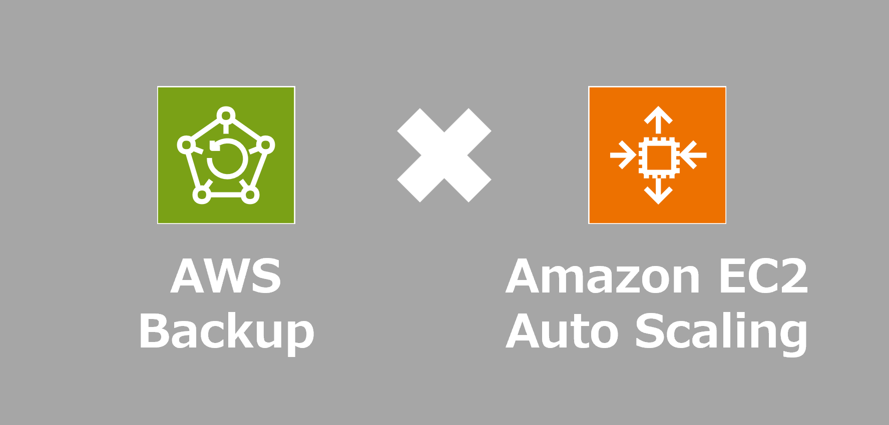

=====================================================================
AWS BackupでAMI作成成功時に自動で起動テンプレートを更新するソリューション
=====================================================================

* `こちらの記事 <https://github.com/coreybutler/nvm-windows>`_ の環境デプロイ用コードを格納しています
* 「 `CDK(Typescript) <./code/cdk-app>`_ 」「 `CloudFormation(yaml) <./code/cfn>`_ 」「 `Terraform <./code/tf>`_ 」用意してますのでお好みで試してみてください
